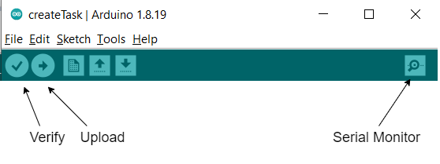
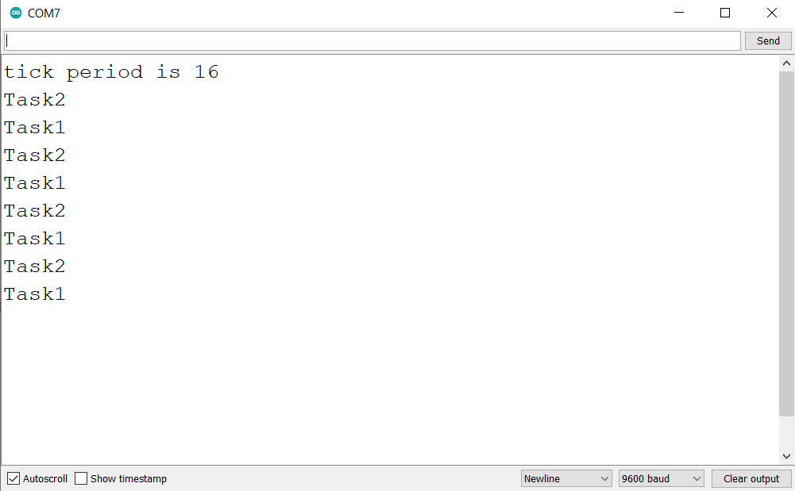

# Create Tasks using FreeRTOS Library
### Hardware
- Arduino Uno
- [USB cable A-B](https://www.amazon.in/USB-Cable-arduino-uno-mega/dp/B084VKTNLP/ref=pd_lpo_1?pd_rd_w=N7Qx4&content-id=amzn1.sym.6fa6e9ce-2890-49c2-bd25-c1096b5f4cf4&pf_rd_p=6fa6e9ce-2890-49c2-bd25-c1096b5f4cf4&pf_rd_r=YZ0KT4XQKZHN2RSCYX5Y&pd_rd_wg=dokhu&pd_rd_r=31a0a15f-7df9-4e6a-8f34-ae6a2ef744ce&pd_rd_i=B084VKTNLP&psc=1)
### Objective
- Communicate with Arduino Uno using Serial Monitor
- Create tasks with priority

### Learnings
- **Serial** is serial port object. Helps to use serial port available in board.
- The RTOS **tick** is a fixed interval periodic interrupt generated form a hardware timer. portTICK_PERIOD_MS is time period b/w two ticks in milliseconds.
- **vTaskDelay** delays a task with number of ticks or unblocks the calling task for given number of ticks.
- **xTaskCreate** creates a new task and add it to task list those are ready to run
  - xTaskCreate( Task_pointer, “task name”, stack_size, Parameters, Priority, TaskHandle)
  - **Task_pointer:** Function pointer
  - **task name:** Just label
  - **stack_size:** In multitasking, each thread has its own stack. It defines stack size in bytes
  - **Parameter:** To pass arguments as void pointer to the function.
  - **Priority:** It is a number with 0 means lowest priority and higher number means higher priority
  - **TaskHandle:** This argument keeps handle of function which can be used for change the priority or deletion of task

### Reference
- [Serial Communication](https://www.arduino.cc/reference/en/language/functions/communication/serial/)
- [Ticks in RTOS](https://www.freertos.org/FreeRTOS_Support_Forum_Archive/April_2005/freertos_Ticks_1264027.html)
- [vTaskDelay](https://www.freertos.org/a00127.html)
- [xTaskCreate](https://www.freertos.org/a00125.html)
- [FreeRTOS with Arduino Tutorial](https://www.youtube.com/watch?v=KjsMTxJVT2M&list=PLS1QulWo1RIbpujtnhn5LRPvYYj_WqbiZ&index=2)

### Steps to compile and upload code
1. Open createTask.ino in your Arduino IDE
2. Verify the code
3. Upload the code
4. Open Serial Monitor to check result

### Result
Tick period in my code is 16ms. In the code Task 2 has higher priority than Task 1. So Task 2 executes before Task 1.
