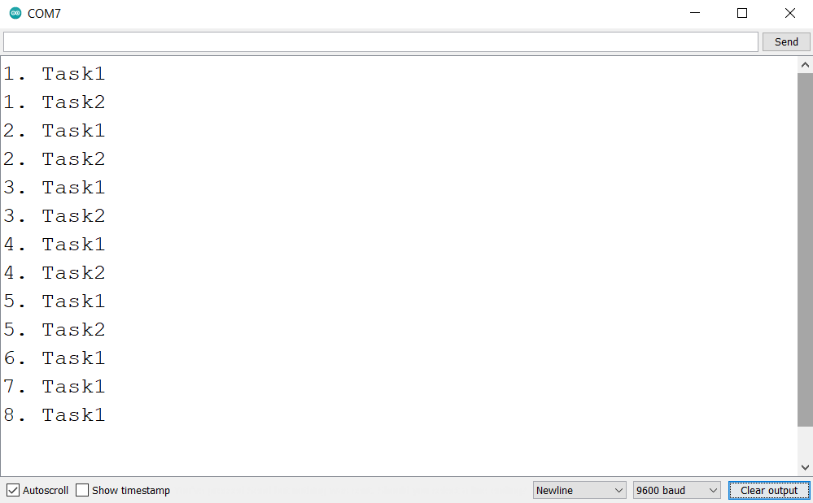
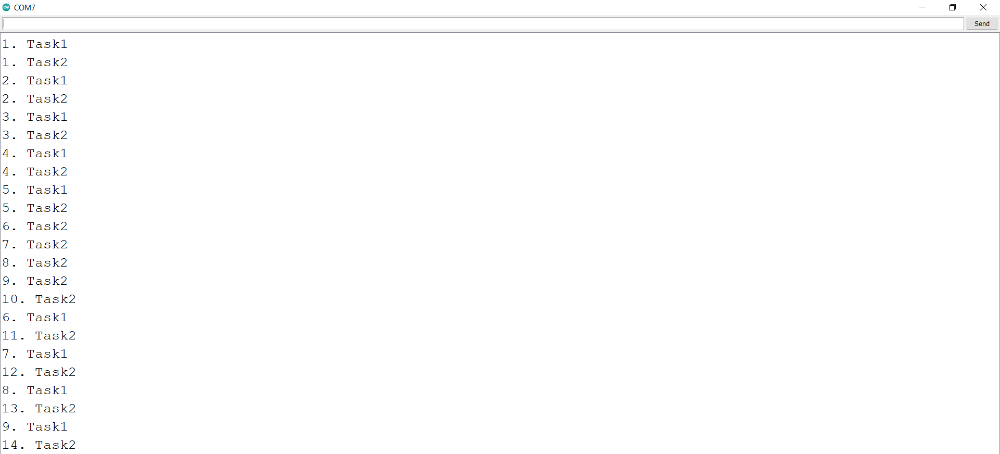

# Delete, Suspend and Resume a Task
### Hardware
- Arduino Uno
- [USB cable A-B](https://www.amazon.in/USB-Cable-arduino-uno-mega/dp/B084VKTNLP/ref=pd_lpo_1?pd_rd_w=N7Qx4&content-id=amzn1.sym.6fa6e9ce-2890-49c2-bd25-c1096b5f4cf4&pf_rd_p=6fa6e9ce-2890-49c2-bd25-c1096b5f4cf4&pf_rd_r=YZ0KT4XQKZHN2RSCYX5Y&pd_rd_wg=dokhu&pd_rd_r=31a0a15f-7df9-4e6a-8f34-ae6a2ef744ce&pd_rd_i=B084VKTNLP&psc=1)
### Objective
- Delete a task using task handle
- Suspend and resume a task using task handle

### Learnings
- vTaskDelete() function is used to delete tasks. With the help of this API function, any task can delete itself and can also delete other tasks by passing reference to a handler.
- vTaskSuspend function is used to suspend a task. The suspended task remains in the same state util resumed.For this, we need to pass the handle of the tasks that needs to be suspended. Passing NULL will suspend own task.
- vTaskResume function is used to resume the suspended task. To resume a task, we need to pass the task handle.
### Reference
- [vTaskDelete official documentation](https://www.freertos.org/a00126.html)
- [vTaskDelete API reference](https://microcontrollerslab.com/freertos-arduino-how-to-delete-tasks-with-vtaskdelete-api/)
- [vTaskSuspend](https://www.freertos.org/a00130.html)
- [vTaskResume](https://www.freertos.org/a00131.html)
- [FreeRTOS with Arduino Tutorial](https://www.youtube.com/watch?v=UR4Aat6WQJY)

### Steps to compile and upload code
1. Open PROJECT/PROJECT.ino in your Arduino IDE
2. Verify the code
3. Upload the code
4. Open Serial Monitor to check result

### Result
1. In deleteTask project, We have killed the Task2 after 5th iteration. We can see in below image that after 5th iteration only Task1 is printing whereas Task2 not.

2. In suspendResumeTask project, we have suspended the Task1 after 5th iteration. Whereas after 10th iteration of Task2, we have resumed Task1. We can verify the algorithm from print statement attached below.
