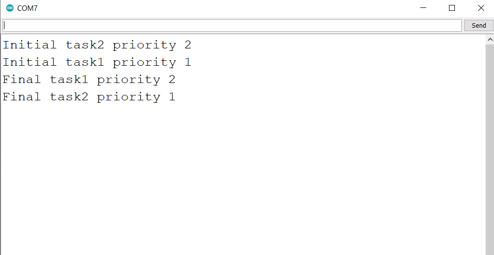

# Change Priority of a Task
### Hardware
- Arduino Uno
- [USB cable A-B](https://www.amazon.in/USB-Cable-arduino-uno-mega/dp/B084VKTNLP/ref=pd_lpo_1?pd_rd_w=N7Qx4&content-id=amzn1.sym.6fa6e9ce-2890-49c2-bd25-c1096b5f4cf4&pf_rd_p=6fa6e9ce-2890-49c2-bd25-c1096b5f4cf4&pf_rd_r=YZ0KT4XQKZHN2RSCYX5Y&pd_rd_wg=dokhu&pd_rd_r=31a0a15f-7df9-4e6a-8f34-ae6a2ef744ce&pd_rd_i=B084VKTNLP&psc=1)

### Objective
- Get priority of task
- Change priority of task

### Learnings
- uxTaskPriorityGet() function is used to get priority of the task. It takes handle of the task. If provided NULL then returns priority of current task.
- vTaskPrioritySet() function is used to change/Set the priority of a task. For this we need to pass the handle of the task and new priority.

### Reference
- [uxTaskPriorityGet official documentation](https://www.freertos.org/a00128.html)
- [vTaskPrioritySet official documentation](https://www.freertos.org/a00129.html)
- [Changing the priority of a task](https://microcontrollerslab.com/changing-task-priority-using-freertos-arduino/)

### Steps to compile and upload code
1. Open PROJECT/PROJECT.ino in your Arduino IDE
2. Verify the code
3. Upload the code
4. Open Serial Monitor to check result

### Result
1. Initially, task1 has priority 1 and task2 has priority 2. After 5 ticks delay, the priority of tasks interchanged.

