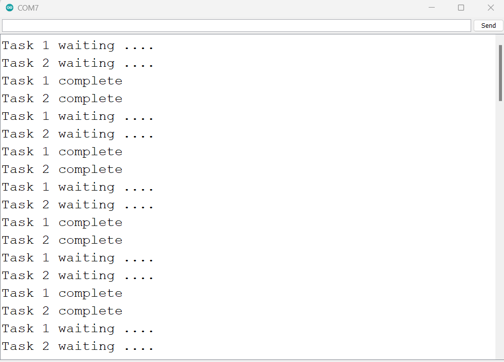
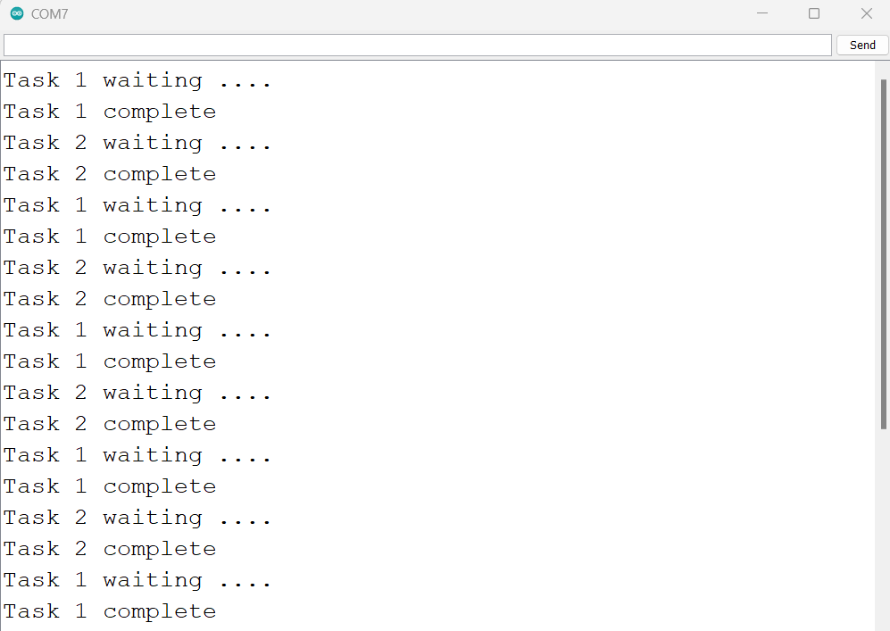

# Mutex
### Hardware
- Arduino Uno
- [USB cable A-B](https://www.amazon.in/USB-Cable-arduino-uno-mega/dp/B084VKTNLP/ref=pd_lpo_1?pd_rd_w=N7Qx4&content-id=amzn1.sym.6fa6e9ce-2890-49c2-bd25-c1096b5f4cf4&pf_rd_p=6fa6e9ce-2890-49c2-bd25-c1096b5f4cf4&pf_rd_r=YZ0KT4XQKZHN2RSCYX5Y&pd_rd_wg=dokhu&pd_rd_r=31a0a15f-7df9-4e6a-8f34-ae6a2ef744ce&pd_rd_i=B084VKTNLP&psc=1)
### Objective
- Create multiple tasks that uses shared resource
- Maintain synchronization using mutex

### Learnings
- xSemaphoreCreateMutex API creates a mutex and returns handle to caller. It doesn't take any argument.
- xSemaphoreTake API can be used to obtain the semaphore. It takes SemaphoreHandle_t and xTicksToWait as parameters.
	- SemaphoreHandle_t is handle to semaphore received during xSemaphoreCreateMutex API call.
	- xTicksToWait is wait period before timeout. If we use portMAX_DELAY then task will wait indefinitely.
- xSemaphoreGet API is used for release semaphore. It takes SemaphoreHandle_t as argument.
### Reference
- [xSemaphoreCreateMutex official documentation](https://www.freertos.org/CreateMutex.html)
- [xSemaphoreTake official documentation](https://www.freertos.org/a00122.html)
- [xSemaphoreGive official documentation](https://www.freertos.org/a00123.html)
- [Semaphore official documentation](https://www.freertos.org/a00113.html)

### Steps to compile and upload code
1. Open PROJECT/PROJECT.ino in your Arduino IDE
2. Verify the code
3. Upload the code
4. Open Serial Monitor to check result

### Result
1. A printer function defined in this project to emulate shared resource. Both task 1 and task 2 uses this function to print messages and delay its execution.
2. Job of printer function to print waiting message, wait for given time and print complete message of one current task before switching to another task.
3. Below image shows result of printer function without mutex. The task 2 entered printer function while task 1 is already present and using same resource.

4. Below image shows that both the tasks are in synchronization and wait for others to complete its execution.
